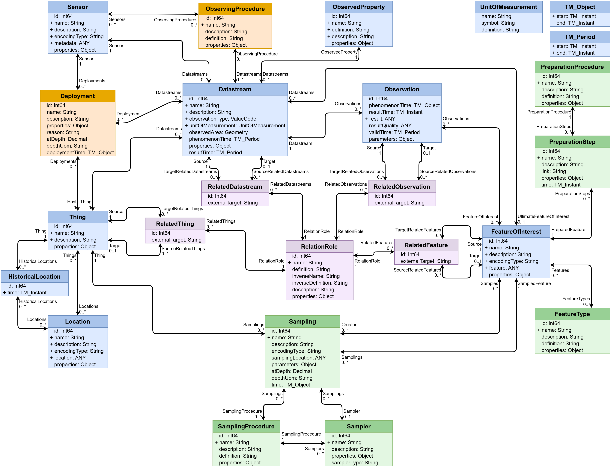

# FROST-Server.Plugin.WaterQualityIE
A FROST-Server Plugin extending the SensorThings data model with the WaterQuality IE data model

## Settings

See the [scripts/docker-compose.yaml](scripts/docker-compose.yaml) for examples.

## Data Model

## Demo Service

An example demo service can be found [here](https://ogc-demo.k8s.ilt-dmz.iosb.fraunhofer.de/FROST-WaterQuality/)
